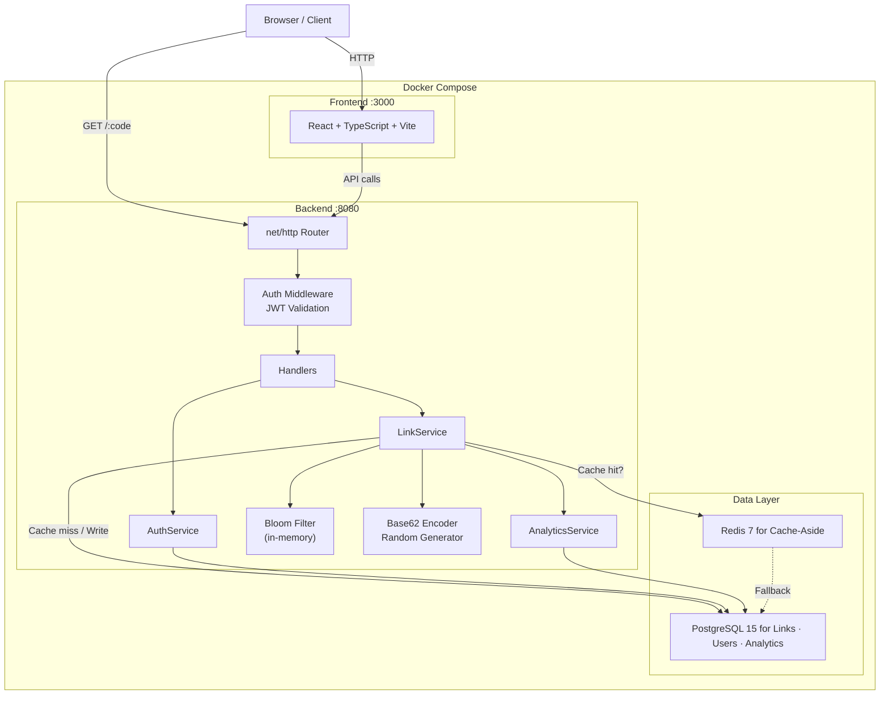

# Shrinks - High-Performance URL Shortener

[](https://go.dev/)
[]()
[](https://www.docker.com/)
[](https://opensource.org/licenses/MIT)

# Shrinks

**A production-grade URL shortener built to demonstrate backend systems design at scale.** Handles 5,000+ requests/second with sub-5ms P99 latency using Go, PostgreSQL, and Redis. Features JWT authentication, per-link analytics, a Bloom filter for collision detection, and a React dashboard — all containerized with Docker Compose and tested through CI.

## Architecture



## Key Metrics

Load tested with [Vegeta](https://github.com/tsenart/vegeta) on a MacBook Air M1.

| Scenario | P50 | P99 | Throughput |
|----------|-----|-----|------------|
| Reads (cold cache) | 1.8ms | 6.8ms | 4,987 req/s |
| Reads (warm cache) | 1.2ms | 3.1ms | 4,995 req/s |
| Writes | 8.2ms | 22.1ms | 998 req/s |
| Mixed (90/10) | 2.4ms | 8.7ms | 2,000 req/s |

Redis caching reduces P99 read latency by over 50%. Write throughput is bottlenecked by PostgreSQL inserts at ~1,000 RPS. Zero errors under sustained load across all scenarios.

## Technical Decisions

### Why Base62 from Sequential IDs?

Short codes are generated by encoding auto-incrementing PostgreSQL IDs into Base62 (`0-9A-Za-z`). This guarantees uniqueness without any collision detection — each ID maps to exactly one code. The trade-off: codes are predictable and enumerable. An attacker could iterate through IDs and discover all shortened URLs.

### Why a Bloom Filter?

To demonstrate an alternative approach, the system supports a configurable random code generation mode. Random 6-character codes aren't enumerable but can collide with existing codes. A Bloom filter provides O(1) in-memory existence checks, avoiding a database round-trip on every write. On startup, the filter is hydrated from PostgreSQL.

**Honest trade-off:** The Bloom filter isn't necessary in sequential mode — collisions are mathematically impossible. It exists to demonstrate understanding of probabilistic data structures and to show how the system would work at scale with random code generation. Both modes are available via a `MODE` environment variable.

### Why Cache-Aside with Redis?

URL shorteners are extremely read-heavy — a single link might be clicked thousands of times but is only created once. The cache-aside pattern fits naturally: check Redis first, fall back to PostgreSQL on a miss, then populate the cache for subsequent reads. Cache entries expire after 24 hours to bound memory usage.

This reduced P99 read latency from 6.8ms to 3.1ms — a 54% improvement.

### Why JWT + Refresh Tokens?

Access tokens expire in 24 hours. Refresh tokens are stored as SHA-256 hashes in PostgreSQL with a 7-day expiry and are rotated on use. This balances stateless authentication (no session store for access tokens) with the ability to revoke sessions (delete the refresh token). Passwords are hashed with bcrypt.

## Tech Stack

| Layer | Technology |
|-------|-----------|
| API | Go 1.24, net/http |
| Database | PostgreSQL 15 |
| Cache | Redis 7 |
| Frontend | React, TypeScript, Vite, Tailwind |
| Auth | JWT access tokens, bcrypt, refresh token rotation |
| Migrations | Goose |
| Containers | Docker Compose |
| CI | GitHub Actions |

## Project Structure

```
backend/
├── cmd/main.go              # HTTP handlers and routing
├── internal/
│   ├── auth/                # JWT, bcrypt, middleware
│   ├── service/             # Business logic (LinkService)
│   ├── analytics/           # Click tracking and aggregation
│   ├── storage/             # PostgreSQL queries
│   ├── cache/               # Redis cache-aside
│   ├── bloom/               # Bloom filter implementation
│   ├── encoding/            # Base62 + random code generation
│   └── model/               # Shared types
├── db/migrations/           # Goose SQL migrations
frontend/
├── src/
│   ├── views/               # React views (Home, Analytics, Links, Login)
│   ├── api/client.ts        # API client with token refresh
│   └── hooks/useAuth.ts     # Auth context and state
```

## Quick Start

```bash
# Clone and start
git clone https://github.com/Unhyphenated/shrinks.git
cd shrinks

# Set environment variables
echo "JWT_SECRET=your-secret-here" > .env

# Start all services
docker compose up -d

# Verify
curl http://localhost:8080/health

# Create a short link
curl -X POST http://localhost:8080/api/v1/links/shorten \
  -H "Content-Type: application/json" \
  -d '{"url": "https://example.com"}'
```

The frontend is available at `http://localhost:3000`. The API runs on `http://localhost:8080`.

### Environment Variables

| Variable | Required | Default | Description |
|----------|----------|---------|-------------|
| `DATABASE_URL` | Yes | — | PostgreSQL connection string |
| `REDIS_URL` | Yes | — | Redis connection string |
| `JWT_SECRET` | Yes | — | Secret for signing JWT tokens |
| `MODE` | No | `sequential` | `sequential` or `random` (Bloom filter) |
| `FALSE_POSITIVE_RATE` | No | `0.01` | Bloom filter false positive rate |
| `ALLOWED_ORIGINS` | No | `localhost:3000,localhost:5173` | CORS origins |

## Testing

```bash
# Unit tests
cd backend && go test -v -tags=unit ./...

# Integration tests (requires Docker services running)
cd backend && go test -v -tags=integration ./...

# Load tests
cd backend/internal/load-tests
./setup.sh 100
./test.sh read 5000 10s
```

## License

MIT

## Contact

**Julian J** — [@Unhyphenated](https://github.com/Unhyphenated)